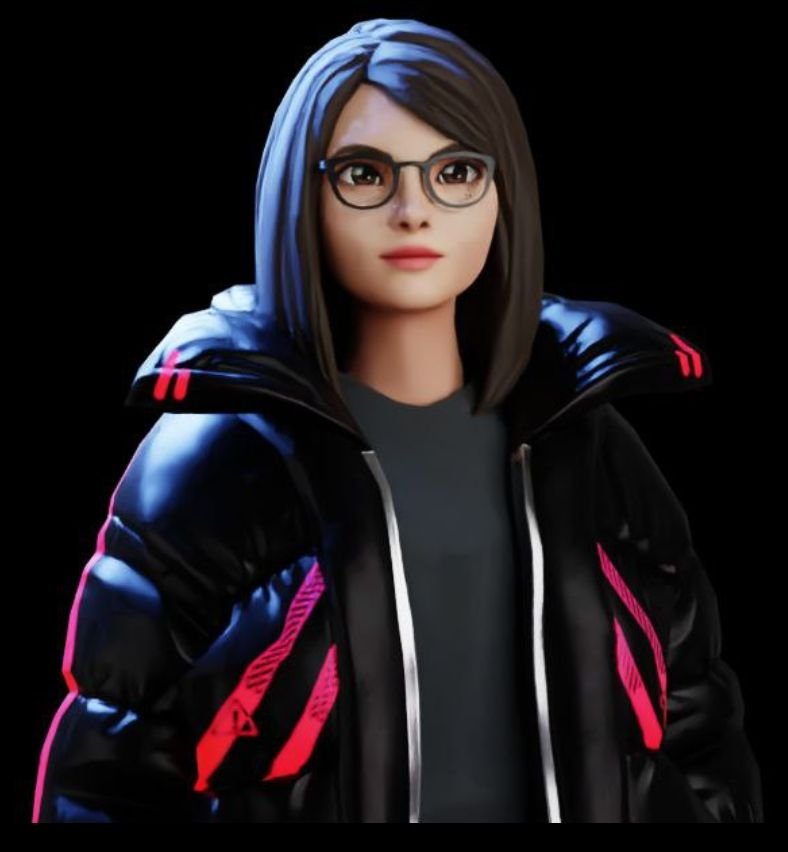
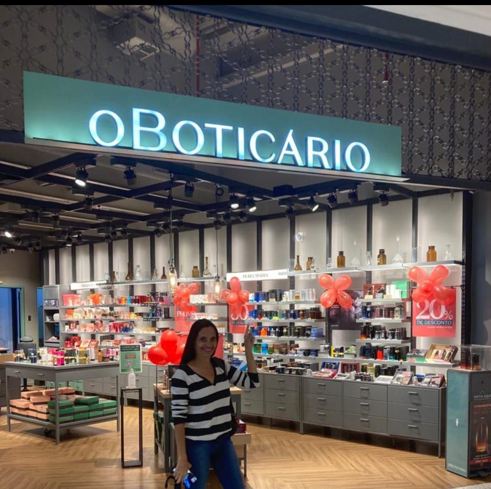

### 🗒 Oiii Eu sou a Renata Patrícia Pausini. Estudante de Tecnologia.

📔 Sou estudante de Análise e Desenvolvimento de Sistemas. 
💻 Estou no programa Desenvolve 2022 do Grupo Boticário / Alura.
💙💚💛💜 Apaixonada por tecnologia e em busca de novos desafios.

#

  <a href="https://github.com/rpatricia">
  
  

#

<h3 align="left"> Contribuidores fake: </h3>

|                                                                                                                            Autora                                                                                                                             |                                                                                                                           Colaboradora                                                                                                                            |
| :-----------------------------------------------------------------------------------------------------------------------------------------------------------------------------------------------------------------------------------------------------------: | :---------------------------------------------------------------------------------------------------------------------------------------------------------------------------------------------------------------------------------------------------------------: |
| [ @rpausini](https://github.com/rpatricia)     | [ @rpausini](https://github.com/rpatricia)     |

#

<h3 align="left"><b> Linguagens e ferramentas:</h3></b>

  

<h3 align="left"><b> Social:</h3></b>

   
  
 

 

<h3 align="left"><b> 
Visualizaçõe:</h3></b>
 

 
 
 

